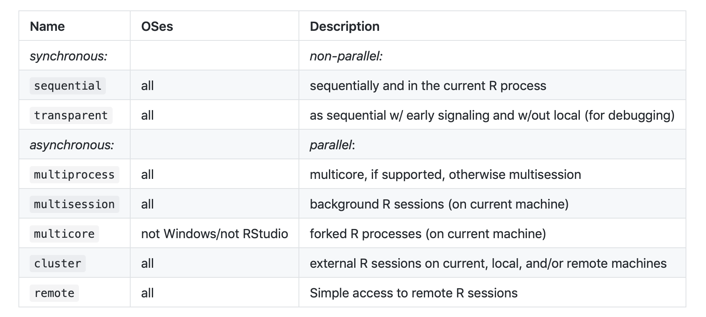

```{r setup, include=FALSE}
knitr::opts_chunk$set()
```

# Principe des objets futurs
## Le but de futur 

Evaluation asynchrone d'expression de R... 

ie : on lance un code qui se lance rapidement, le resultat du code n'est pas forcément directement accessible. 

```{r}
library(tictoc)
library(future)
```


## Un premier exemple 

```{r}
plan(multiprocess)
miaou <- function(a){
  Sys.sleep(2)
     a+1
}
f1 <- future({
  miaou(2)
  })

```


Essai de créer un vecteur de futur : ne fonctionne pas, même pour une liste. À creuser.

```{r, eval=FALSE}
vec <- list()
for (i in 1:8){
  vec[[i]] %<-%  {
  miaou(i)
  }
}

```

## Le "Reçoit dans le future" : %<-%

```{r}
f2 %<-%{
  a <- 1
for(i in 1:10000){
  for(j in 1:3000)
  {a <- a  + j / 25}
} 
  a}
```

On peut vivre sa vie pendant qu'il réfléchit et fait tourner le code. Par exemple en lançant d'autres codes après la création d'un objet futur, la session n'est pas bloquée en attendant le résultat, comme c'est le cas d'habitude. 

```{r}
"lalalala"

cat("Jeudi c'est la boum!! (Peut être)")
```


Puis pour obtenir le résultat :

```{r}

value(f1)
f2
```

Si on est trop  préssés et qu'on appelle l'objet futur trop vite (alors qu'il n'a pas finit de tourner), la session va "réfléchir" jusqu'à l'obtention du résultat (=résolution de l'objet) comme en R normal. 


# Plan d'exécution 

On peut choisir différents endroits pour "lancer le future" en utilisant plan 
(En effet on ne veut pas faire planter notre session avec un tel code...)


```{r}
plan(multisession)
f %<-%{
 "Jeudi c'est la boum!! (Peut être)"
  }
```

## Les différents Plan

```{r}
plan(sequential)
tic()
nothingness %<-% {Sys.sleep(2)}
toc()
#> 6.08 sec elapsed
# This should take ~2 seconds running in parallel, with a little overhead
plan(multiprocess)
tic()
nothingness %<-% {Sys.sleep(2)}
toc()
```

# D'autres futurs existent !
## Furrr :  Future map 

Avec furrr c'est très facile de paralléliser les map!

```{r}
library(furrr)
# This should take 6 seconds in total running sequentially
plan(sequential)
tic()
nothingness <- future_map(c(2, 2, 2), ~Sys.sleep(.x))
toc()
#> 6.08 sec elapsed
# This should take ~2 seconds running in parallel, with a little overhead
plan(multiprocess)
tic()
nothingness <- future_map(c(2, 2, 2), ~Sys.sleep(.x))
toc()
#> 2.212 sec elapsed

```


## Future apply 
On peut aussi utiliser future pour les apply 

```{r}
 require(future.apply)

plan(multiprocess)
x <- 1:3
tic()
y <- future_lapply(x, FUN = quantile, probs = 1:3/4)
toc()

require(parallel)
tic()
y <- mclapply(x, FUN = quantile, probs = 1:3/4)
toc()

```
