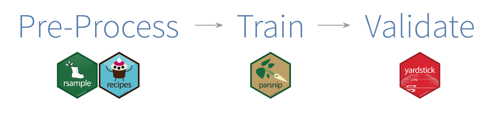

```{r setup, include=FALSE, warning=FALSE}
knitr::opts_chunk$set(echo = TRUE)
knitr::opts_chunk$set(error = TRUE)
```


#<!--# Tidyverse {.tabset .tabset-fade .tabset-pills} -->

# Tidyverse #{.tabset .tabset-fade .tabset-pills}

#<!-- {.tabset .tabset-fade .tabset-pills} use this code to make tabs, but does not work with the anchors (internal liks) --> 

## Tidyverse: Global overview 

Tidyverse permet de faciliter le modélisation des données en les pretraitant et les visulisant.

Pour une vision global voici le site web: <https://www.tidyverse.org/>, vous pouvez également regarder la présentation de StateoftheR d'Antoine Bichat <https://abichat.github.io/Slides/Modeling/Modeling.html#1>.

Si vous voulez voir les dernières mises à jour du packages <https://github.com/tidyverse/dplyr/releases>

[{width=14%}](#tidymodels-link) [{width=13%}](#readr-link) [{width=13%}](#rlang-link)


## Tidymodels {#tidymodels-link}


Le package tidymodels permet d'installer et de charger les packages tidyverse permettant de faciliter la modélisation de données. Les packages de tidymodels ne permettent pas de construire les modèles statistiques, mais de faciliter toutes les étapes de prétraitement et de visualisation des données.

Ces étapes se divisent en plusieurs sous-étapes :
- le prétraitement des données peut être effectué grâce aux packages rsample (ré-échantillonnage des données) et recipes (création et traitement de matrice de design)
- l'apprentissage peut être effectué grâce à parsnip (fournit une interface commune de modélisation)
- la validation peut être effectuée grâce à yardstick (évaluation des performances de différents types de modèles)




Pour plus d'infos : <https://rviews.rstudio.com/2019/06/19/a-gentle-intro-to-tidymodels/>.


## Readr {#readr-link}


### Opérateurs de Rlang {#rlang-link}
Les opérateurs de rlang pour passer les variables colonnes aux fonctions tidyverse

<!--Rlang par Herr Lang-->

Source <https://www.tidyverse.org/articles/2019/06/rlang-0-4-0/>

### Syntaxe Tidyverse

La syntaxe Tidyverse permet d'utiliser les noms de colonnes du tableau de données comme des noms de variables globales tout le long du tuyau. Cette compréhension est perdue dans les définitions de fonction au moment où la variable est appelée dans la fonction. Pour récupérer cette possibilité, il faut présenter le nom de variable différemment dans la définition de fonction. L'ancienne solution consistait à utiliser des opérateurs peu clairs qui provenaient des méthodes de programmations internes. Le package rlang 4.0.4 propose un opérateur double accolade qui est équivalent. De la même façon, il est possible de passer les variables colonne arguments par leur nom sous forme de chaînes mais l'appel dans la fonction se fait par .data double crochet.
```{r, message=FALSE, warning=F}
library(tidyverse)
```

### Variable colonne appelée en mode commande
Dans le contexte d'un tuyau en mode commande, les colonnes "gender" et "mass" peuvent être appelées comme des variables :


```{r }
starwars %>%
  group_by(gender) %>%
  summarise(mass_maximum = max(mass, na.rm = TRUE))
```

### Variable colonne appelée dans une fonction
On définit une fonction qui effectue la même tâche que précédemment:
```{r pressure, echo=TRUE}
max_by <- function(data, var, clef) {
  data %>%
    group_by(clef) %>%
    summarise(maximum = max(var, na.rm = TRUE))
}

starwars %>% max_by(mass, gender)

```

La variable colonne n'est plus trouvée car dans l'exécution de la fonction, l'environnement de la variable (c'est-à-dire l'indication qu'il s'agit d'une colonne du tableau de données)  est perdu. Pour conserver cette indication, on emploie la fonction enquo qui garde en mémoire l'environnement de la variable

```{r , echo=TRUE}
max_by <- function(data, var, clef) {
  data %>%
    group_by(enquo(clef) )%>%
    summarise(maximum = max(var, na.rm = TRUE))
}

starwars %>% max_by(mass, gender)

```
Le message d'erreur a changé : la sortie de  la fonction enquo  n'est pas interprétable immédiatement par la fonction tidyverse. il faut utiliser l'opérateur !! pour  présenter cette sortie aux fonctions tidyverse :

```{r , echo=TRUE}
max_by <- function(data, var, clef) {
  data %>%
    group_by(!!enquo(clef))%>%
    summarise(maximum = max(var, na.rm = TRUE))
}

starwars%>% max_by(mass, gender)

```
La colonne mass n'est pas trouvée car nous n'avons pas encore corrigé cette partie du code. Le code enquo()  est assez mystérieux pour un utilisateur; une petite visite dans l'aide confirme la difficulté : la fonction   enquo ( et ses amis UQ, "!", "!!") est prévue pour écrire des fonctions internes. Utilisée sans maîtrise, elle génère des erreurs dificiles à interpréter. Le package rlang propose un opérateur compact double accolade qui remplace "!!enquo()". 
```{r , echo=TRUE}
max_by <- function(data, var, clef) {
  data %>%
    group_by({{clef}}) %>%
    summarise(maximum = max(!!enquo(var), na.rm = TRUE))
}

starwars %>% max_by(mass, gender)
```
### Appel des variables colonne par passage d'une chaîne de caractère
Si les variables sont désignées par des chaînes, il faut  utiliser l'opérateur double crochet avec un préfixe particulier ".data[[ ]]". Le préfixe "." n'est pas utilisé car il réfère à la structure de données initiale et pas à celle courante au moment de l'exécution de la fonction tidyverse.
```{r , echo=TRUE}
max_by <- function(data, var, chaineclef) {
    data %>%
      group_by(.data[[chaineclef]]) %>%
      summarise(maximum = max(.data[[var]], na.rm = TRUE))
  }
  
  starwars %>% max_by("height", "gender")
```
  
  
  
  

