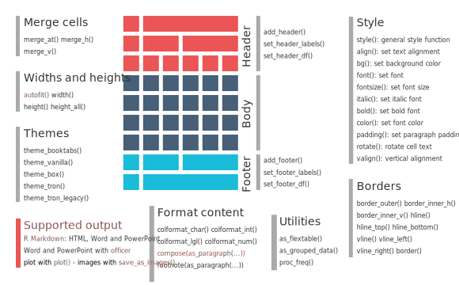

```{r setup, include=FALSE}
knitr::opts_chunk$set(echo = TRUE, 
                      message = FALSE, 
                      cache = TRUE)
```

```{r}
library(tidyverse)
library(gt) ## for gtcars
gtcars <- gtcars[1:20, ]
```


Comparison of function to display a `data.frame` in markdown outputs. 

Outputs covered:

- default
- kable and [kableExtra](https://cran.r-project.org/web/packages/kableExtra/index.html)
- [flextable](https://cran.r-project.org/web/packages/flextable/index.html)
- [gt](https://github.com/rstudio/gt)

## Default output


```{r}
gtcars
```


## kable

```{r}
knitr::kable(gtcars)
```

## kableExtra

```{r}
library(kableExtra)
kableExtra::kable(gtcars) %>%
  kable_styling(bootstrap_options = c("striped", "hover"))
```

## flextable

https://davidgohel.github.io/flextable/articles/overview.html

Allow to export as html, pdf or office. 



```{r}
library(flextable)
flex_gtcars <- flextable(gtcars)
flex_gtcars
```

`flextable` generates a flextable object.

### Select columns

Select only some columns with `col_keys`

```{r}
flextable(gtcars, 
          col_keys = c("bdy_style", "hp", "hp_rpm"))
```


### Themes

Some themes are already available.

```{r}
theme_vanilla(flex_gtcars)
theme_vader(flex_gtcars)
theme_zebra(flex_gtcars)
```


### Cell merging

Merge adjacent cells with equal values, either vertically (`merge_v`) or horizontally (`merge_h`)

```{r}
merge_v(flex_gtcars, 
        j = ~ mfr)
```

Manually cells with `merge_at`

### Group rows

```{r}
flextable(as_grouped_data(gtcars, groups = "mfr"))
```


### Format

https://davidgohel.github.io/flextable/articles/format.html

font, color

```{r}
flextable::color(flex_gtcars, part = "header", color = "red")
flextable::fontsize(flex_gtcars, part = "body", size = 6)
flextable::bg(flex_gtcars, part = "header", bg = "gray30")
```

Conditional formatting

```{r}
flextable::bg(flex_gtcars, i = ~ year > 2016, bg = "red")
```


### Bars in table

Adds barplots or linerange 

```{r}
flex_gtcars %>% 
  compose(j = "hp", 
          value = as_paragraph(minibar(value = hp))) %>% 
  compose(j = "trq", 
          value = as_paragraph(linerange(value = trq)))
```


##  gt

https://github.com/rstudio/gt


`gt()` create a `gt_tbl` object.

```{r}
library(gt)
gtcars %>% 
  gt()
```

### Add header and footer notes

```{r}
gtcars %>%
  gt() %>%
  tab_header(
    title = "gtcars",
    subtitle = glue::glue("subtitle")
  ) %>% 
  tab_footnote(footnote = "some notes on mfr", locations = cells_column_labels("mfr"))
```


### Group rows

Group rows according to groups in dataframe

```{r}
tab <- gtcars %>% 
  group_by(ctry_origin) %>% 
  unite(col = car, mfr, model) %>% 
  gt(rowname_col = "car")
tab
```


### Group columns

Group columns with `tab_spanner`

```{r}
tab %>% 
  tab_spanner(label = "Performance",
    columns = vars(mpg_c, mpg_h, hp, hp_rpm, trq, trq_rpm)
  ) %>% 
  tab_spanner(label = "Type", 
              columns = vars(trim, bdy_style))
  

```

### Format columns

`fmt_` functions to change values formatting (such as scientific, currency, date...)

```{r}
tab %>% 
  fmt_currency(columns = vars(msrp), currency = "EUR") %>% 
  fmt_scientific(columns = vars(hp_rpm))
```


### Style

Change style for some cells/columns/rows.

```{r}
tab %>%
  cols_align(
    align = "center",
    columns = vars(mpg_c, hp, trq)
  ) %>%
  tab_style(
    style = cell_text(size = px(12), color = "red"),
    locations = cells_data(
      columns = vars(trim, trsmn, mpg_c, hp, trq))
  )
```


### Summary rows

Adds summaries of rows

```{r}
tab %>% 
  summary_rows(groups = TRUE, 
               columns = vars(hp, hp_rpm),
               fns = list(
                 average = "mean",
                 total = "sum",
                 SD = "sd"))
```


## gt or flextable?

- High overlap in terms of functionality between the two packages. Both are heavily documented.
- `flextable` allows export to office, `gt` doesn't.
- `gt` is from rstudio, more support/dev? `flextable` is french!

