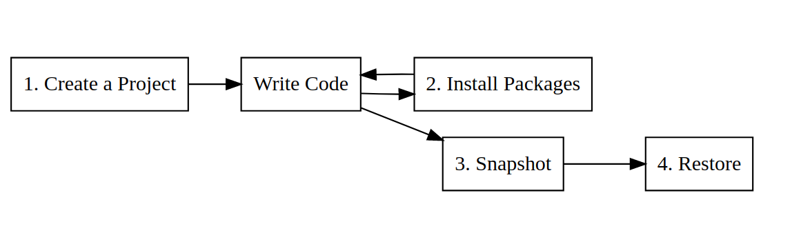
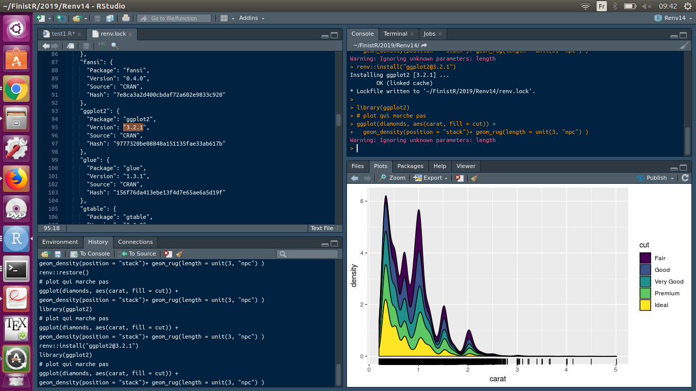
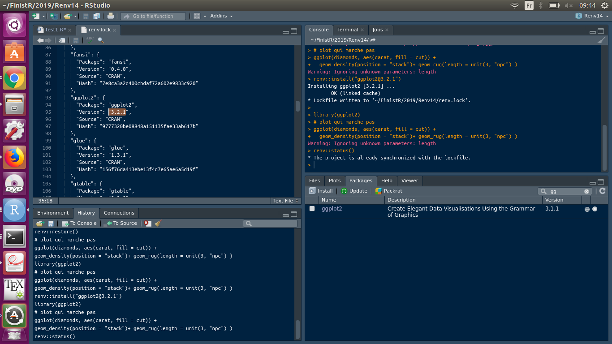
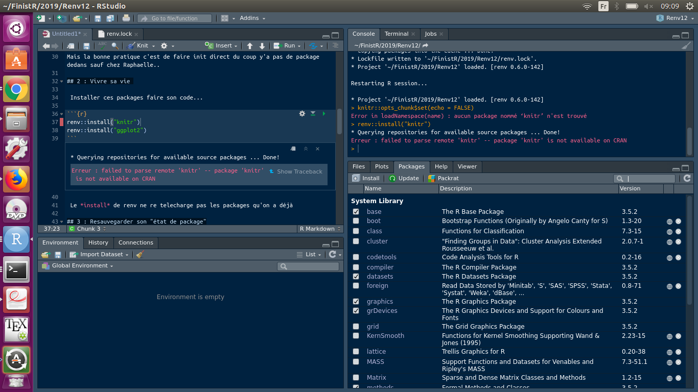
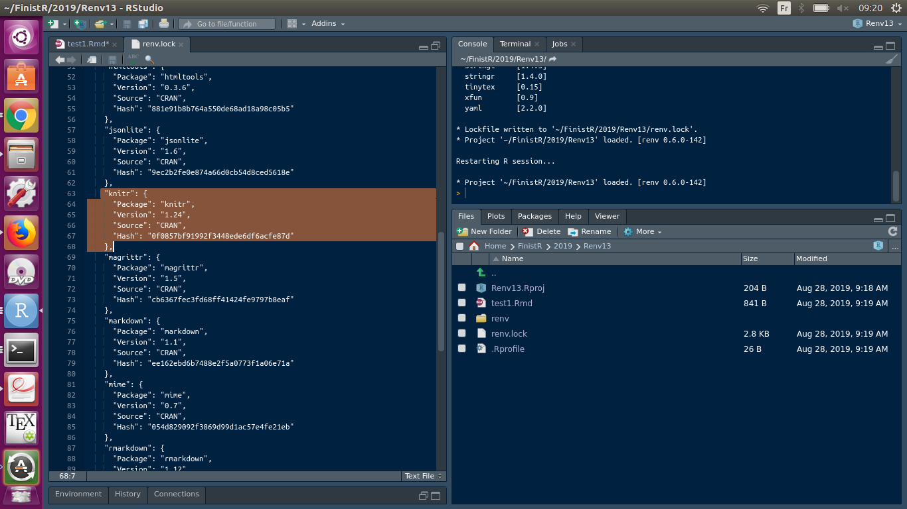

```{r setup, include=FALSE}
knitr::opts_chunk$set( )
require(tidyverse)
theme_set(theme_minimal())
```

# Introduction
## Principe

Renv permet de créer un "état de librairies", qui enregistre les packages et leur versions. C'est une bonne pratique qui assure la reproductibilité d'un code facilement.

 {width=1000px}

## Nos premières remarques... 

Renv est un package de Rstudio qui est en cours de développement. Au cours de nos tests, nous avons rencontré plusieurs surprises et quelques bugs que nous avons tenté de comprendre.

- Premier mystère : On a pas la même chose :o : deux ordinateurs peuvent avoir un état initial vide des librairies différent.
- Est-ce plus malin d'initialiser le projet avant ou après la rédaction des scripts ?
- Si tu fais pas gaffe tu peux faire n'iiiimpooorte quoii
- Certains exemples ne collent pas le package à l'air en pleine evolution!

# Commandes principales
## 1 : faire un init 

```{r}
renv::init()
```


Cela créer un fichier renv.lock qui contient les versions des packges utilisés dans les scripts, la version de R tout ça tout ça.
La bonne pratique c'est de faire l'initialisation du renv en début de projet, du coup y'a pas de package dedans. Sur l'ordinateur de Raphaëlle, le renv.lock de départ contenait également des informations de bioconductor..

## 2 : Vivre sa vie 

 Une fois le renv.lock initialisé, on peut le remplir avec des nouveaux packages. La commande renv::install() va installer les packages nécessaires. Important: on peut installer une version spécifique d'un package, par exemple ggplot2 3.1.1 alors que la version installée sur la machine est 3.2.1 :
 
```{r}
renv::install("ggplot2")
```
 


```{r}
renv::install("ggplot2@3.1.1")
```

 Le *install* de renv ne re-telecharge pas les packages qu'on a déjà grâce au cache. Bien sûr si les packages ne sont pas déjà installés, renv le fait.

## 3 : Resauvegarder son "état de package"

Une fois le package installé, il est dans le cache de renv mais pas encore inscrit dans renv.lock. Pour que les liens soient faits, il faut:

- appeler le package en question par exemple avec library()
- sauvegarder le fichier .R qui contient l'appel au package
- utiliser la commande renv::snapshot(), qui prend un "instantanné" de l'état des librairies.

Attention pour ajouter dans snapshot il faut qu'il soit utilisé, et sauvegarder le fichier !

```{r}
renv::snapshot()
```
 
## 4 : (Re)Vivre sa vie

Les étapes renv::install et renv::snapshot peuvent être réutilisées au cours du travail. 

## 5 : Deux possibilités : save or not to save 

Le dernier snapshot correspond à la version de l'état des libraries qui devra être utilisées pour reproduire le projet. Si la dernière version n'est pas satisfaisante, on peut revenir à la version des packages d'avant avec restore().

- On est heureux avec nos nouveaux packages mis à jour 

```{r}
renv::install("ggplot2@3.1.1")
```
 
- On est triste avec nos nouveaux packages mis à jour 

```{r}
renv::restore()
```
 
 pour revenir à la version des packages d'avant


## Si on veut répliquer le code d'un petit camarade

On peut si il nous envoie son  renv.lock à jour (et son code...), puis en effectuant la commande renv::restore()

```{r}
renv::restore(lockfile = "raph.lock")
```

## On peut vérifier qu'on est bien à jour dans notre ".lock"

```{r}
renv::install("glmnet")
renv::status()
```


```{r}
renv::snapshot()
renv::status()
```

# Bugs
## versions réelles / versions affichées

Nous avons testé un code ggplot2 qui fonctionne avec la version 3.2.1 mais pas 3.1.1 : l'argument length n'est reconnu que par la version 3.2.1.  Sur cette capture, on voit que c'eset la version 3.2.1 qui est inscrite dans le renv.lock, en revanche le code testé utilise une version antérieure qui ne reconnait pas le paramètre length.

{width=1000px}


## faux message de renv::status ?

Ici la version installée de ggplot2 est la 3.1.1 (et le plot ne fonctionne pas, cf capture du dessus) pourtant le renv.lock possède la 3.2.1 et renv::status ne détecte pas cette différence de versions. 

{width=1000px}


## créer un init dans un markdown

Le fonctionnement de renv avec Rmarkdown est un peu particulier. 

Situation 1:
- on créer un fichier .Rmd
- on oublie de le sauvgarder 
- on fait renv::init()

Alors les packages nécessaires à Rmarkdown ne sont pas dans le renv.lock (normal, on a pas sauvé), mais EN PLUS renv:install() ne peut pas retrouver ces packages nécessaires.

Si on init dans un RMarkdown sans avoir sauvé avant le fichier .Rmd:
{width=1000px} 

Situation 2 :
- on créer un fichier .Rmd
- on pense à sauvgarder 
- on fait renv::init()

Aucun soucis, c'est la bonne pratique ! Renv gardien des bonnes pratiques rmd :)
{width=1000px}

Situation 3 : 
- créer un nouveau projet, vide
- faire renv::init()
- créer un nouveau .Rmd

 À ce moment-là, c'est Rstudio qui va demander l'autorisation de ré-installer les packages knitr et compagnie. C'est propre, mais lourd car ces packages ne sont pas dans le cache de renv !

## Nos premières questions... 

- Premier mystère : On a pas la même chose :o
**Bonne question**
- Est-ce plus malin de faire d'abord les scripts ? 
**Si tu fais d'abord les scripts il ajoute directement les packages sans que tu ais besoin de faire les install (pratique pour rmarkdown par exemple) mais ipq c'est pas une bp**
- Si tu fais pas gaffe tu peux faire n'iiiimpooorte quoii
**cf notre collection de  BUUUG**

## Site utils : 
https://rstudio.github.io/renv/articles/renv.html
