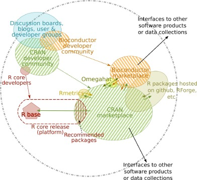
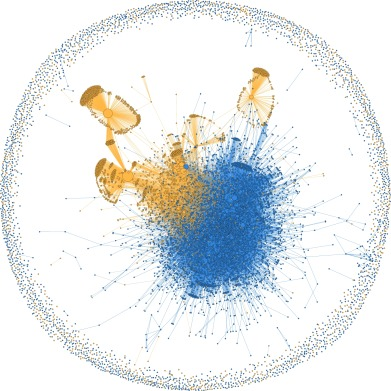

```{r setup, include=FALSE}
knitr::opts_chunk$set(echo = TRUE)
```

## Software Ecosystem

L'écosystème (d'un) logiciel est un nouveau concept pour le développement collaboratif de logiciel.

Il s'agit de l'étape la plus récente du processus qui a fait passer les logiciels de logiciel monobloc, produit intégré, à des logiciels plus ouverts, plus modulaires et plus collaboratifs.
Dans un écosystème logiciel, une communité de développeurs collabore de façon asynchrone et souvent sans direction central à travers d'une plateforme ou un marché logiciel commun. 


## R Software Ecosystem

L'écosystème R a grandi d'un outil de niche pour les statisticiens du domaine académique à une solution populaire pour une communité plus large dans la fouille et l'analyse de données. Il est ainsi devenu un langage parmi les plus populaires dans le monde. Il est passé de la 9eme à la 5eme place entre 2014 et 2016 et est aujourd'hui à la 7eme place. (source : [IEE Spetrum] https://spectrum.ieee.org/at-work/innovation/the-2018-top-programming-languages )

### R ?

[Les 25 ans de R](https://rss.onlinelibrary.wiley.com/doi/epdf/10.1111/j.1740-9713.2018.01169.x)

R est un langage de programmation et environnement libre et open-source sous licence GNU dérivé du langage S. Naissance en 1993 (Gentleman and Ihaka), code public en 1995. Le coeur de R a commencé son existence en 1997 (11 personnes) avec la création du CRAN et est maintenu depuis par la fondation R et la _'R Core Team'_ (Hornik, 2015)

Application principale : calculs statistiques et graphiques

En plus du code R, du code en Fortran, C et C++ est utilisé de façon intensive. R est disponible à la fois sur Windows, MacOS et les plateformes dérivées d'UNIX. 

Le dépôt principal pour les produits logiciels développés par la communité R, appelés _packages_, est le _CRAN_ (the Comprehensive R Archive Network, or CRAN (The Comprehensive R Archive Network, 2017)).

Il existe d'autres projets en lien avec R (https://www.r-project.org/other-projects.html) dont les principaux sont
_Bioconductor_ pour le domaine de la bioinformatique, la _R-forge_ ou _Omegahat_ autour du calcul distribué.

Et un certain nombre de packages existe indépendamment notamment dans des dépöts de code comme _GitHub_.

R peut être exécuté en ligne de commande ou via des GUIs ou IDEs dont le principal est _RStudio_ (2017) développé sous la direction d'[Hadley Wikham](https://fr.wikipedia.org/wiki/Hadley_Wickham, http://hadley.nz).

### L'écosystème R



3 domaines principaux : la *plateforme R*, le *marché logiciel* et la *communauté*, ainsi que les interactions associées. 
Les flèches en pointillées représentent l'impact de la communauté sur l'offre logicielle, les flèches en trait plein représentent les dépendances entre les packages.
La plateforme R comprend les packages installés par défaut : des packages inclus dans R base et proposés par la 'R core team' et quelques packages recommandés produits par la communauté (installé par défaut comme parti du noyau mais hébergés indépendamment sur le CRAN).
Il existe des vendeurs autres tels que _Microsoft_ qui offre des plateformes de base parfois plus élargies.

### La communauté R

Elargissement facilité par le _tidyverse_ : des utilisateurs contributeurs, des utilisateurs 'purs' issus des sciences du vivant, la démographie, la sociologie.

[R-ladies](https://rladies.org) (depuis 2012 sous impulsion initiale de Gabriela de Queiroz, [article businessinsider] (http://www.businessinsider.fr/us/gabriela-de-queiroz-ibm-manager-r-ladies-meetup-2019-8?utm_medium=referral&utm_content=topbar&utm_term=mobile&referrer=twitter))

Constat initial : communauté dominée par les hommes et femmes participant parfois mais n'intéragissant que peu. 1 octobre 2012 : pemière rencontre 'R_ladies' à San Francisco.

En 2018 : des meet-up dans 122 villes avec plus 28000 membres. 
Auj (aout 2019) : 47 pays, 167 groupes, 48416 membres.

Mission : The R-Ladies mission is _'to achieve proportionate representation by encouraging, inspiring, and empowering people of genders currently underrepresented in the R community'_.

Quelques chiffres : 
- en 2016 entre 11 et 15$%$ des développeurs de package étaient des femmes.
- nombre d'exposés invités donné par des femmes aux conférences _useR!_ passé de zero en 2004 à 34% in 2016.

## Analyse de l'écosystème R

Etudier l'écosystème et détecter caractéristiques et des tendances

### German et al. (2013) : 

A partir de 52 utilisateurs et les packages qu'ils utilisent (données de 2011) : étude des caractéristiques du code et relations de dépendance entre la plateforme R et les packages proposés par la communauté. Ils montrent que les 'contributed' packages sont moins documentés, ont moins de versions, sont plus récents, moins téléchargés et moins réutilisés que ceux de la plateforme R. Et à partir des listes de diffusion de R, ils ont montré que la communauté d'utilisateurs finaux avait grandi de façon super-linéaire tandis que la communauté de développeurs étaient restée stable.

### Claes et al. (_Software Engineering Lab, University of Mons, Belgium_), Decan et al.

Etude dans un objectif de maintenance des packages à partir des erreurs de code et des dépendances.
<!-- Ex : à partir des occurences d'erreur dans les packages sur une période de 3 mois, ils ont montré que les erreurs provenaient principalement de mise à jour dans les dépendances du package et on  -->

Topologie des réseaux de dépendance entre packages

Etude des liens de dépendance entre les dépôts principaux de code (CRAN, GitHub, R-forge)

### Plakidasa et al. (2016, 2017)

Etude de l'écosystème R ; et de son évolution dans l'idée de détecter des tendances au niveau de l'écosystème ou au niveau individuel.

Etude du point de vue des dépôts de code (interaction entre les packages) ou étude des interactions entre la communauté et le marché.

Quelques caractéristiques : les packages les plus importants pour la communauté sont dus à un group noyau de peu d'utilisateurs.

Questions :
1. Comment le marché R s'est construit ? 
Etude de la structure de dépendance en terme de composition, profondeur et d'interconnexion (recherche de communautés)

2. Comment les membres de la communauté contribuent à R ?

3. Quel est l'état courant de l'écosystème R?

Données :
Packages issus de Bioconductor et CRAN (doc, code, archives)



Si vous êtes intéressés par les résultats, allez lire le papier !

<!-- In another study (Claes et al., 2015), Claes et al. identified different types of code cloning behaviour within R packages. The authors also pointed out the rise of GitHub both for active development as well as for hosting packages, but reaffirmed the importance of CRAN as the main repository for R packages, both numerically and, more importantly, dependency-wise. Decan et al. (2015) also examined the dependency links between the main repositories of the R ecosystem, i.e., CRAN, Bioconductor, GitHub, and R-Forge, and found that CRAN is largely self-contained and forms the basis upon which the other repositories build. In another study, Decan et al. (2016) returned to consider the maintainability problems from breaks in backwards compatibility between packages hosted in CRAN and GitHub, which is attracting an increasing share of R packages not hosted elsewhere. -->

<!-- Our own first study (Plakidas et al., 2016), examined the broad outlines of the R ecosystem’s characteristics, particularly from the aspect of its division into two principal repositories, CRAN and Bioconductor. Unlike German et al. (2013), we examined the entire content of the ecosystem, both past and present, but we did not consider GitHub or other minor repositories since, just as  Decan et al. (2015), we found that CRAN and Bioconductor were self-contained repositories. Our study contained a quantitative assessment of the R ecosystem’s platform, marketplaces, and communities, established the main package and contributor metrics, and measured R’s growth in these metrics throughout its existence. We discovered that a core group of users, linked to the development of the R platform, have played the most crucial role in extending the R ecosystem’s functionality by contributing to the most important community-developed packages as well. We also made an attempt to combine the metrics we had gathered in a predictive model for package behaviour, but found that no meaningful results were possible with the data available. -->

<!-- This study builds upon and significantly extends this work to examine the evolution of the R ecosystem in greater depth, particularly from the aspect of interaction between the community and the marketplaces. We examine in much more detail the community and marketplace networks, identify the main categories of ecosystem components, the forces that have shaped it and what role they have played, thereby extending the quantitative analysis to examine qualitative aspects of the R ecosystem. -->

<!-- 4. Objectives -->
<!-- Inspired by similar studies in the literature presented in the previous sections, we used the data we gathered on the R ecosystem’s past and present state to formulate metrics that can be used to gain insights on the ecosystem’s evolution and detect any underlying trends, both on the level of the entire ecosystem, as well as on the level of individual ecosystem members. The metrics we used are those defined in proposed frameworks (Jansen, 2014, Franco-Bedoya, Ameller, Costal, Franch), or commonly used in network analysis, and which can be generated easily, and as far as possible automatically, from openly accessible information, rather than requiring intensive human input for generation. -->

<!-- A platform-oriented SECO like R comprises three main components: the software platform, the community of users, and the marketplace(s) where additional software products are offered. In the present study, we focus on a high-level examination of the latter two components, whose existence and synergy present the main extension offered by SECOs as software development paradigms. -->

## Références

Konstantinos Plakidasa, Daniel Schallb and Uwe Zdun. _Evolution of the R software ecosystem: Metrics, relationships, and their impact on qualities_ Journal of Systems and Software, 132: 119-146. (2017)


