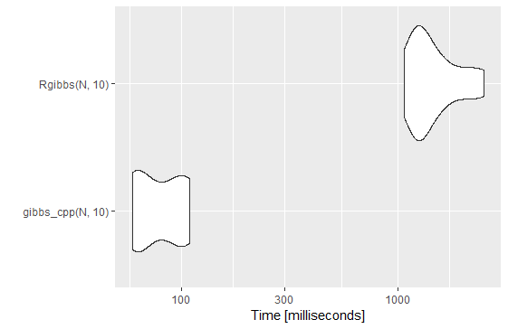

```{r setup, include=FALSE}
knitr::opts_chunk$set(echo = TRUE, 
                      cache = TRUE)
```
Nous rappelons ici quelques principes de bases pour inclure du code C++ dans un code R. Ces notes se basent sur la présentation faite dans le cadre du groupe de travail StateOfTheR, à retrouver [ici](https://stateofther.github.io/post/bases-rcpp/). 


# Différences d'architectures entre R et C++

Un statisticien écrit un code dit source. Ce code peut être lu facilement par un humain (on parle de language *high level*). Cependant, pour pouvoir être lu et éxécuté par un CPU (microprocesseur) le language *high level* doit être transformé en language *bas niveau* (i.e. 0 1 0 0 0 1 ). 

Pour passer du code source au code binaire, on a besoin d'un traducteur. Ce traducteur sera soit un **compileur** (tel que C++) ou un **interpréteur** (tel que R).

> Un **compileur** traduit le code avant son interprétation (on parle de *compilation*), une fois pour toutes. 

> Un **interpréteur** traduit le code à la volée,  au moment de son exécution. 

Par conséquent,  un **compileur** prend le code en entier et le traduit en une fois. On ne fera la tâche qu'une fois (économie de temps). Cependant les éventuelles erreurs ne sont listées qu'après la complète traduction (code difficile à débugguer). Par ailleurs, la version compilée est plus difficile à partager (selon les os, un utilisateur peut avoir besoin de recompiler le code). 

Alternativement, un **interpréteur** traduit le code commande par commande. Donc le débugguage est plus facile. Mais ceci est refait à chaque exécution (perte de temps). On ne partage que le code source. 


Les languages du type compileur nécéssite de spécifier la nature des  objets utilisés dans la fonction. Au moment de la compilation, le compileur doit connaitre la nature des objets. 


Rcpp permet de transformer un code C++ en une fonction lisible en R (`my_function`). 
Donc on commence par un code C++, le compileur de Rcpp (i.e. le compileur de C++ i.e. gcc) transforme cette instruction en un code avec extension `my_function.o`.  Si ma fonction fait appel à d'autres fonctions C++ présentes dans d'autres libraries C++, je dois les lier. Pour cela Rcpp dispose d'un *linker*. Ma fonction est ensuite exportée pour devenir une fonction interprétable par R.  

A noter qu'il existe une librairie *RcppArmadillo* qui contient des fonctions d'algèbre linéaire écrites en C++. Pour l'utiliser, il faudra inclure en début du fichier `.cpp` les intructions suivantes:


```{Rcpp armadillo, echo=TRUE, eval = FALSE }
#include "RcppArmadillo.h"
// [[Rcpp::depends(RcppArmadillo)]]
using namespace Rcpp;
using namespace arma;  // Evite d'écrire arma::fonctionArmadillo
```
Une fois cette librairie chargée, il est possible d'écrire un code C++ très semblable à ce qu'on écrirait en R (hormis la définition des objets). Typiquement, *RcppArmadillo* permet d'utiliser des matrices, d'en calculer la taille, d'utiliser des fonctions du type `dnorm`, `rgamma`...
 
# Ecrire une fonction en cpp avec Rcpp 

Le language C++ nécéssite de déclarer le format de toutes les variables (en entrée, en sortie et dans la fonction). 
Nous proposons ci-dessous un code écrit en `R` et son équivalent écrit en `Rcpp`. 
L'algorithme suivant simule une chaîne de Markov (Gibbs). 

```{R gibbs_r, echo=TRUE, eval = FALSE }
gibbs_r <- function(N, thin) {
  mat <- matrix(0, ncol = 2, nrow = N)
  x <- 0
  y <- 0
  for (i in 1:N) {
    for (j in 1:thin) {
      x <- rgamma(1, 3, y * y + 4)
      y <- rnorm(1, 1 / (x + 1), 1 / sqrt(2 * (x + 1)))
    }
    mat[i, ] <- c(x, y)
  }
  return(mat)
}
``` 

```{Rcpp gibbs, echo=TRUE, eval = FALSE }
// [[Rcpp::export]]  // nécéssaire pour exporter la fonction ensuite sous R
NumericMatrix gibbs_cpp(int N, int thin) {
  
  NumericMatrix res (N,2); // définit une matrice de 0 de taille (N,2) (résultats)
  double x = 0;  // définit un numérique (double précision) initialisé à 0. 
  double y = 0; 
  int indexline = 0;  // définit un entier qui va nous permettre de remplir la matrice
  for (int i = 0 ; i < N ; i++){
    indexline = i; 
    for (int j = 0; j < thin; ++j){
      x = rgamma(1, 3, y * y + 4)[0];
      y = rnorm(1, 1 / (x + 1), 1 / sqrt(2 * ( x + 1)))[0];
    }
    res(indexline,0) = x; 
    res(indexline,1) = y; 
  } 
  return res;
}

```

La fonction `gibbs_cpp`est écrite dans un fichier `my_functions_cpp.cpp`. Ce fichier peut contenir plusieurs fonctions `cpp`, il faut spécifier de l'exporter avant chaque fonction par l'instruction  `// [[Rcpp::export]]`.  

*Quelques remarques utiles sur le code Rcpp* : 

  - toutes les instructions doivent être terminées par `;`,
  - l'indexation commence à $0$,
  - on accède à un élément d'un vecteur par des crochets `[.]`,
  - on accède à un élément d'une matrice par des parenthèses `(.,.)`. 
    

# Utilisation d'une fonction cpp en R 
La commande suivante permet de transformer notre fonction `cpp` en fonction `R`.

```{R exportation, echo=TRUE, eval = FALSE }
library(Rcpp)
sourceCpp("my_functions_cpp.cpp")
``` 
On a alors dans l'environnement une fonction `R` appelée `gibbs_cpp`. 
On peut maintenant comparer les temps de calculs. 


```{R compart temps, echo = TRUE, eval =  FALSE}
library(microbenchmark)
N <- 10000
thin <- 10
res_compar <- microbenchmark(gibbs_cpp(N, thin), gibbs_r(N, thin), times = 10)
ggplot2::autoplot(res_compar)
```



On gagne globalement un facteur $10$ sur cette simple fonction. 
L'utilisation de code C++ est recommandée lorsque le code repose sur une boucle `for` qui ne peut être remplacée par un calcul matriciel. 

