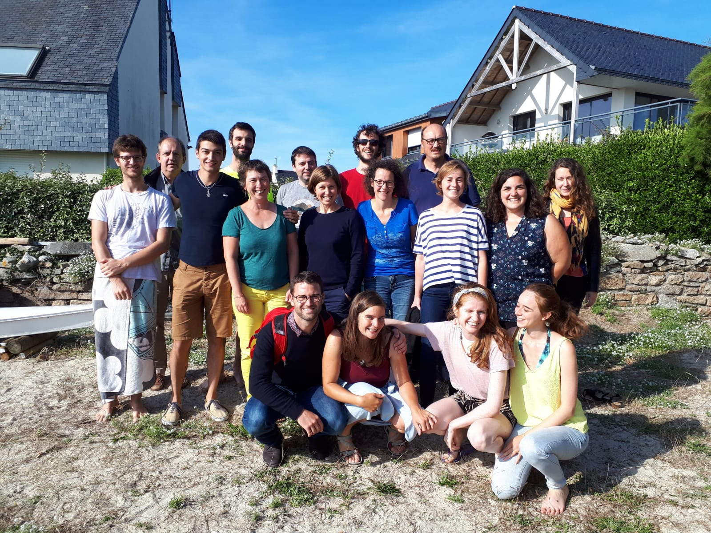

```{r setup, include=FALSE}
knitr::opts_chunk$set(echo = FALSE, cache = TRUE)
library(tidyverse)
library(DT)
```

## Où ? Quand ?


La station biologique de Roscoff a accueilli  la troisième édition du R Bootcamp  du groupe  [State Of The R](https://stateofther.github.io/) **du 26 août  au 30 août 2019**.

<iframe src="https://www.google.com/maps/embed?pb=!1m17!1m11!1m3!1d863.0230997053625!2d-3.987533179360306!3d48.72647094495075!2m2!1f0!2f0!3m2!1i1024!2i768!4f13.1!3m3!1m2!1s0x4813e153cbdda967%3A0x6cd2956ee2bb8cfb!2sStation+Biologique+de+Roscoff!5e1!3m2!1sfr!2sfr!4v1557410926937!5m2!1sfr!2sfr" width="600" height="450" frameborder="0" style="border:0" allowfullscreen></iframe>


## Qui



### 1er rang

- [Timothée Tabouy](https://tabouyt.github.io/) (UMR MIA Paris)
- [Marie Perrot](https://www6.inra.fr/mia-paris/Equipes/Membres/Marie-Perrot-Dockes) (UMR MIA Paris)
- [Mathieu Carmassi](https://mathieucarmassi.github.io/) (UMR MIA Paris - EDF)

### 2ème rang

- [Félix Cheysson](Félix Cheysson • Research - Institut Pasteur) (UMR MIA Paris)
- [Antoine Bichat](https://github.com/abichat) (UMR Maiage - INRA)
- [Marie-Pierre Étienne](https://marieetienne.github.io/) (IRMAR - Agrocampus Ouest)
- [Sophie Donnet](https://www6.inra.fr/mia-paris/Equipes/Membres/Sophie-Donnet) (UMR MIA Paris - INRA), 
- [Julie Aubert](https://www6.inra.fr/mia-paris/Equipes/Membres/Julie-Aubert) (UMR MIA Paris - INRA), 
- [Marie Morvan](https://irmar.univ-rennes1.fr/interlocuteurs/marie-morvan) (IRMAR - Université de Rennes 1), 
- [Marine Marjou](https://informatique-mia.inra.fr/biosp/homepage-marine-marjou) (UMR BioSP - INRA), 
- [Claire Gayral](http://pbil.univ-lyon1.fr/members/cgayral) (UMR CNRS 5558 - LBBE), 


### 3ème rang

- [Gabriel Lang](https://www6.inra.fr/mia-paris/Equipes/Membres/Gabriel-Lang) (UMR MIA Paris - Agroparistech)
- [Pierre Barbillon](https://www6.inra.fr/mia-paris/Equipes/Membres/Pierre-Barbillon) (UMR MIA Paris - Agroparistech)
- [Pierre Gestraud](https://science.curie.fr/members/pierre-gestraud/) (Institut Curie)
- [Pierre Gloaguen](https://papayoun.github.io/) (UMR MIA Paris - Agroparistech)
- [Pierre Navaro](https://irmar.univ-rennes1.fr/interlocuteurs/pierre-navaro) (IRMAR - CNRS)


## Quoi ?

Cette semaine a été consacrée à l'approfondissement de diverses thématiques (méthodologiques, techniques) autour du logiciel `R`: ce site proposera un compte rendu des différents thèmes abordés. Les participants collaborent tous au contenu de ce site lors d'ateliers organisés en petits groupes.

Le compte rendu des éditions précédentes sont disponibles 

  - [Finist'R 2018](https://stateofther.github.io/finistR2018/)
  - [Finist'R 2017](https://stateofther.github.io/finistR2017/)


<!-- ```{r} -->
<!-- participants <- read_csv("ListeParticipants_feuille3.csv", col_types = "cccc") -->
<!-- ``` -->

<!-- ## Participants  -->

<!-- L'atelier Finist'R 2019 se tient à la Station Biologique de Roscoff du 26 au 30 août 2018. Les participants sont -->

<!-- ```{r} -->
<!-- datatable(participants, options = list(pageLength = 17, dom = "t")) -->
<!-- ``` -->


## Programme 

Le programme proposé est le suivant


```{r}
prog <- 
  as_tibble(readODS::read.ods(file = "Programme.ods")[[1]]) %>%
  rename(Horaire = A, Lundi = B, Mardi = C, Mercredi = D, Jeudi = E, Vendredi = `F`) %>%
  filter(Horaire != "")

activites <-
  prog %>%  
  gather(key = condition, value = activité, -Horaire) %>%  
  distinct(activité) %>% 
  as_vector()

color_used <-
  activites %>%
  enframe(name = NULL) %>%
  mutate(col = case_when(str_detect(value, "Bilan")       ~ "#97b1bd",
                         str_detect(value, "Atelier 1")   ~ "#def7cf",
                         str_detect(value, "Atelier 2")   ~ "#c3f2a7",
                         str_detect(value, "Atelier 3")   ~ "#b5f48d",
                         str_detect(value, "Atelier 4")   ~ "#96e863",
                         str_detect(value, "Atelier 5")   ~ "#96cf47",
                         str_detect(value, "Repas|Pause") ~ "#d2d9d6",
                         value == "" ~ "",
                         TRUE        ~ "#fea741")) %>%
  pull(col)

prog %>% 
  datatable(options = list(pageLength = 17, dom = "t", ordering = FALSE),
            rownames = FALSE) %>%
  formatStyle(columns = c(2:ncol(prog)),
              backgroundColor = styleEqual(activites , color_used))
```

Les séquences en vert correspondent à des séances d'atelier en sous groupes. Les séquences en orange correspondent à un panorama du sujet indiqué, tandis que les séquences en bleu correspondent à des temps de réflexion et rédaction sur le rendu final.


### Atelier 1 : Distill, communication et diffusion avec R

#### Exploration du package distill pour la creation de document scientifique
[Une présentation de distill](https://rstudio.github.io/distill/website.html)


#### R pour la communication

- Des nouvelles de __blogdown__
- Le site de mon package avec __pkgdown__ : [le tuto de  C. Gillespie à useR2019](https://www.jumpingrivers.com/t/2019-user-git/#1) 
- Des sites web avec R
- Des livres avec __bookdown__
- Des tables avec __flextable__
- ...


#### Idées de réalisation

- Mise en place du site de rendu
- Structuration d'un document distill pour la soumission dans des conférences (RencontreR 2020 : ajout de tags, customiser la mise en forme, importer une contribution depuis un dépot github)
- Écrire une thèse avec __bookdown__


###  Atelier 2 : R écosysteme, Docker, R et Python, R et ...

#### Docker

- Mettre en place les élements pour créer une image Docker, tester différentes instances pour utiliser différentes versions de R sur la même machine
- __packrat__ pour la gestion de packages
- __renv__ pour la gestion de packages


#### Interfaces

- __reticulate__ pour lier Python et R

#### Idées de réalisation

- Comparer les résultats (performance et temps de calcul) d'une approche de classification par forêts aléatoires en R et Python
- Mettre en place une image docker pour le contenu de la semaine. 

### Atelier 3 : R for big data

#### Manipuler des données massives sous R

- Package __[data.table](https://cran.r-project.org/web/packages/data.table/vignettes/datatable-intro.html)__


#### Machine learning
- R et __[H2O](https://www.h2o.ai/wp-content/uploads/2018/01/RBooklet.pdf)__
- __caret__
- __parsnip__


#### Idées de réalisation

- Un gros jeu de données, on compare les performances de différents modèles d'apprentissage


### Atelier 4 : tidyverse : quoi de neuf ?


- Un tour des nouveautés dans le tidyverse
- Programmation dans le tidyverse avec __rlang__


### Atelier 5 : Modèle mixte avec R : quelles sont les bonnes options ?

- Les packages à comparer __lme4__, __lmerTest__, __MCMCglmm__, __mlmRev__, __broom.mixed__, __nlme__, __glmmmTMB__
- __[spaMM](https://kimura.univ-montp2.fr/~rousset/spaMM/spaMMintro.pdf)__


