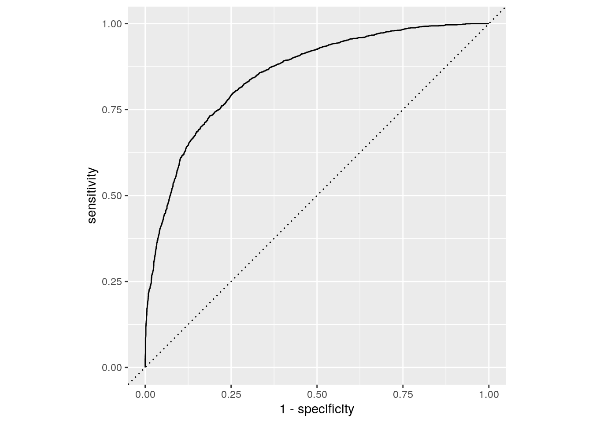
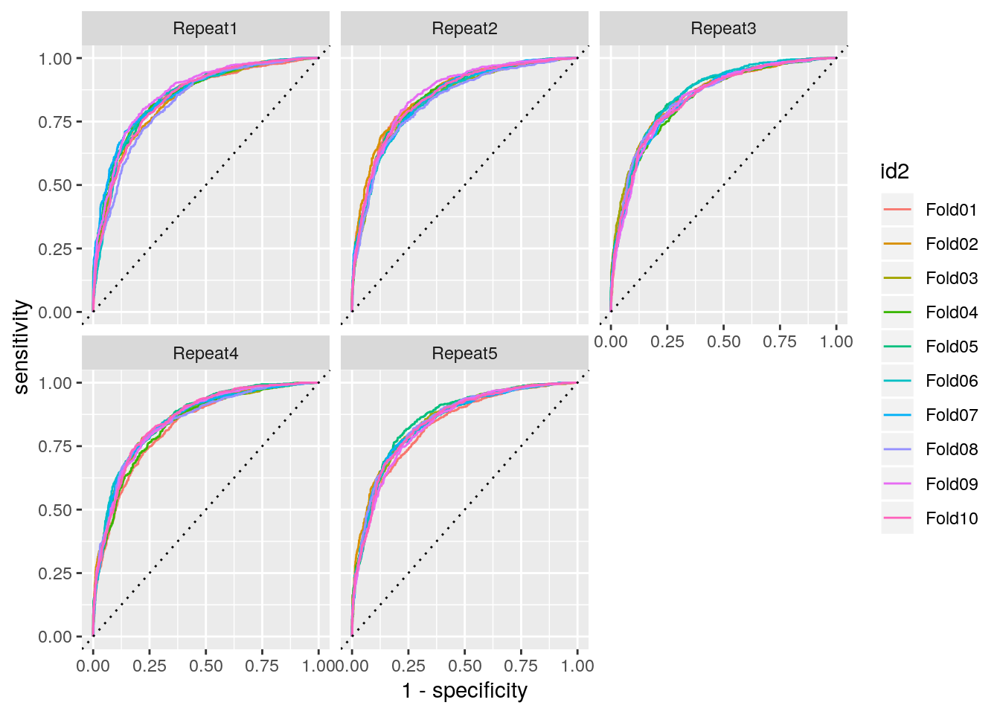

We explore the `tidymodels` framework which allows to work in a unified workflow for different models. `tidymodels` is a meta package like `tidyverse`. Here we will focus only on:

- `parsnip`: unified interface for ml models 
- `rsample`: interface to define resampling sets
- `yardstick`: computation of models performance


```r
library(tidymodels)
library(tidyverse)
```

Example dataset is an extract from kaggle: https://www.kaggle.com/uciml/forest-cover-type-dataset


```r
forest_data <- read_csv("data/covtype_small.csv")
```

The dataset has 24757 observations and 55 variables. We want to predict the `Cover_Type` according to all variables.

We keep only a part of data to be in a 2 class prediction problem. This will delete some variables which are constant over all observations. 


```r
## remove columns with only 0s
forest_data <- 
  forest_data %>% 
  select_if(.predicate = ~n_distinct(.) > 1) 

## set type as factor
forest_data <- 
  forest_data %>% 
  mutate(Cover_Type = as.factor(Cover_Type))
```

The dataset has now 24757 observations and 50 variables.


# First split 

We split the dataset into training and test sets with `rsample::initial_split` with proportion 3/4 and respecting the `Cover_Type` strata.


```r
## create initial train/test split
forest_split <- initial_split(forest_data, prop = 3/4, strata = "Cover_Type")
forest_train <- training(forest_split)
forest_test <- testing(forest_split)
```

# Logistic regression

## Model estimate

First we model a logistic regression on the whole training dataset. The framework of parsnip consists in first defining the type of model (here `logistic_reg`), the engine (the underlying package which effectively estimate the model) with `set_egine` and then estimate the model on the data with `fit`.


```r
## logistic model
logit_fit <- 
  logistic_reg(mode = "classification") %>%
  set_engine(engine = "glm") %>% 
  fit(Cover_Type ~ ., data = select(forest_train, -Soil_Type40))
```

```
## Warning: glm.fit: algorithm did not converge
```

```
## Warning: glm.fit: fitted probabilities numerically 0 or 1 occurred
```

## Prediction

To get predicted values we use `predict` as usual.


```r
## get prediction on train set
pred_logit_train <- predict(logit_fit, new_data = select(forest_train, -Soil_Type40))
## get prediction on test set
pred_logit_test <- predict(logit_fit, new_data = select(forest_test, -Soil_Type40))
## get probabilities on test set
prob_logit_test <- predict(logit_fit, new_data = select(forest_test, -Soil_Type40), type="prob")
```

## Model performance

`yardstick` is a package to get metrics on model performance. By default on classification problem `yardstick::metrics` returns accuracy and kappa.


```r
metrics(bind_cols(forest_test, pred_logit_test), truth = Cover_Type, estimate = .pred_class)
```

<div class="kable-table">

.metric    .estimator    .estimate
---------  -----------  ----------
accuracy   binary        0.7771853
kap        binary        0.5401555

</div>

We also have access to other metrics with specific functions such as `yardstick::spec` for specificity, `yardstick::precision`, `yardstick::recall`... These metrics can be combined to be estimated together with `yardstick::metric_set`.


```r
multimetric <- metric_set(accuracy, bal_accuracy, sens, yardstick::spec, precision, recall, ppv, npv)
multimetric(bind_cols(forest_test, pred_logit_test), truth = Cover_Type, estimate = .pred_class)  
```

<div class="kable-table">

.metric        .estimator    .estimate
-------------  -----------  ----------
accuracy       binary        0.7771853
bal_accuracy   binary        0.7678956
sens           binary        0.7066667
spec           binary        0.8291246
precision      binary        0.7528409
recall         binary        0.7066667
ppv            binary        0.7528409
npv            binary        0.7932886

</div>

`yardstick::roc_auc` computes the area under the roc and `yardstick::roc_curve` data to plot the roc.


```r
roc_auc(bind_cols(forest_test, prob_logit_test), truth = Cover_Type, .pred_1)
```

<div class="kable-table">

.metric   .estimator    .estimate
--------  -----------  ----------
roc_auc   binary        0.8519712

</div>

```r
roc_data <- roc_curve(bind_cols(forest_test, prob_logit_test), truth = Cover_Type, .pred_1) 
roc_data %>%  
  ggplot(aes(x = 1 - specificity, y = sensitivity)) +
  geom_path() +
  geom_abline(lty = 3) + 
  coord_equal()
```

<!-- -->

# Cross-validation

In this part we estimate again a logistic regression but on 10-fold cross validation samples.

`rsample::vfold_cv` creates the sampling scheme. Here we create 5 repetitions of a 10 fold cv.


```r
## create 5 times a 10 fold cv
cv_train <- vfold_cv(forest_train, v = 10, repeats = 5, strata = "Cover_Type")
```

We define next some functions to fit the model, get the predictions and the probabilities. 


```r
logit_mod <- 
  logistic_reg(mode = "classification") %>%
  set_engine(engine = "glm")

## compute mod on kept part
cv_fit <- function(splits, mod, ...) {
  res_mod <-
    fit(mod, Cover_Type ~ ., data = analysis(splits), family = binomial)
  return(res_mod)
}

## get predictions on holdout sets
cv_pred <- function(splits, mod){
  # Save the 10%
  holdout <- assessment(splits)
  pred_assess <- bind_cols(truth = holdout$Cover_Type, predict(mod, new_data = holdout))
  return(pred_assess)
}

## get probs on holdout sets
cv_prob <- function(splits, mod){
  holdout <- assessment(splits)
  prob_assess <- bind_cols(truth = as.factor(holdout$Cover_Type), 
                           predict(mod, new_data = holdout, type = "prob"))
  return(prob_assess)
}
```

We apply these functions on the cv data.


```r
res_cv_train <- 
  cv_train %>% 
  mutate(res_mod = map(splits, .f = cv_fit, logit_mod), ## fit model
         res_pred = map2(splits, res_mod, .f = cv_pred), ## predictions
         res_prob = map2(splits, res_mod, .f = cv_prob)) ## probabilities
```

We can compute the model preformance for each fold:


```r
res_cv_train %>% 
  mutate(metrics = map(res_pred, multimetric, truth = truth, estimate = .pred_class)) %>% 
  unnest(metrics) %>% 
  ggplot() + 
  aes(x = id, y = .estimate) +
  geom_point() + 
  facet_wrap(~ .metric, scales = "free_y")
```

```
## Warning: Unquoting language objects with `!!!` is deprecated as of rlang 0.4.0.
## Please use `!!` instead.
## 
##   # Bad:
##   dplyr::select(data, !!!enquo(x))
## 
##   # Good:
##   dplyr::select(data, !!enquo(x))    # Unquote single quosure
##   dplyr::select(data, !!!enquos(x))  # Splice list of quosures
## 
## This warning is displayed once per session.
```


ROC curve on each fold:


```r
res_cv_train %>% 
  mutate(roc = map(res_prob, roc_curve, truth = truth, .pred_1)) %>% 
  unnest(roc) %>% 
  ggplot() +
  aes(x = 1 - specificity, y = sensitivity, color = id2) +
  geom_path() +
  geom_abline(lty = 3) + facet_wrap(~id)
```




